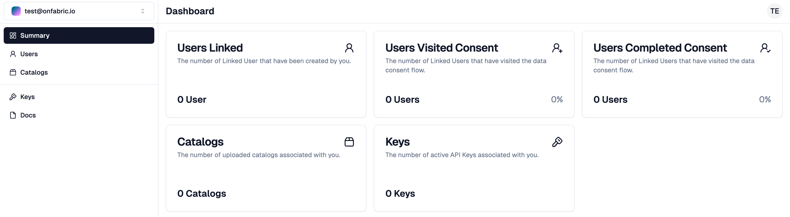
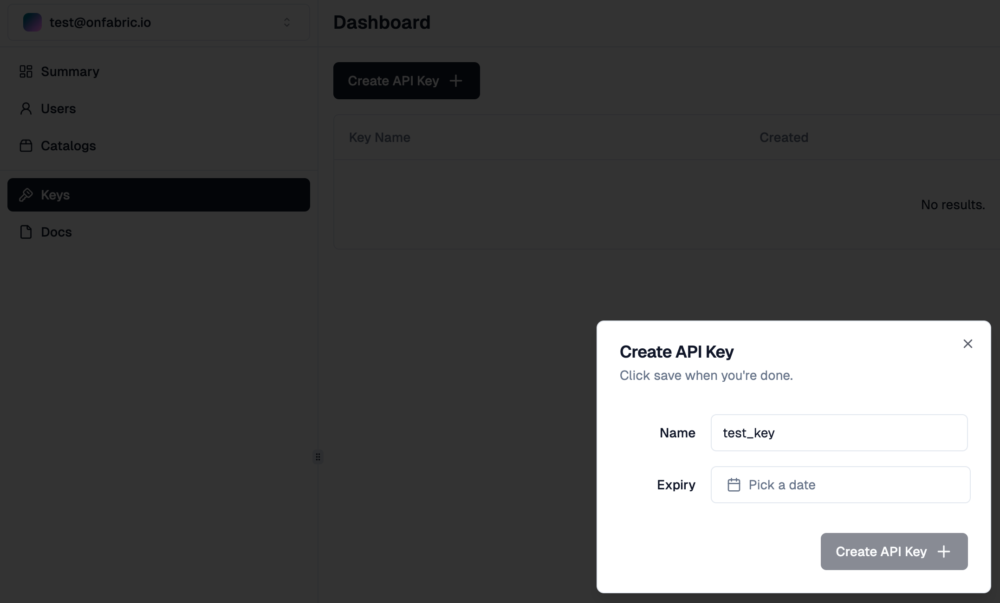
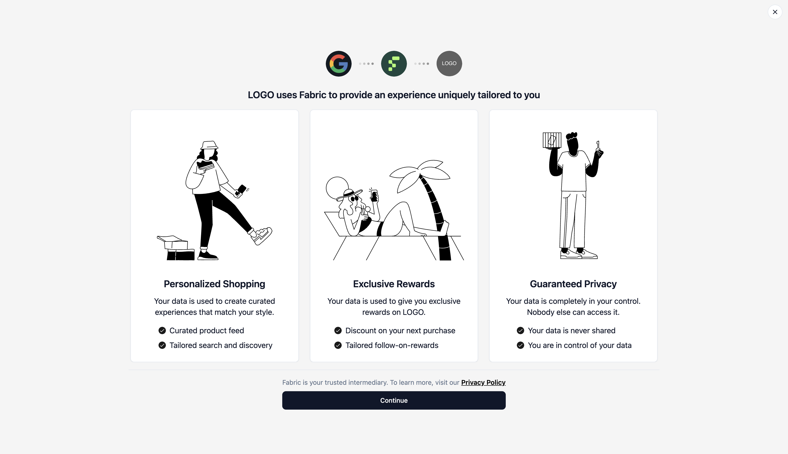
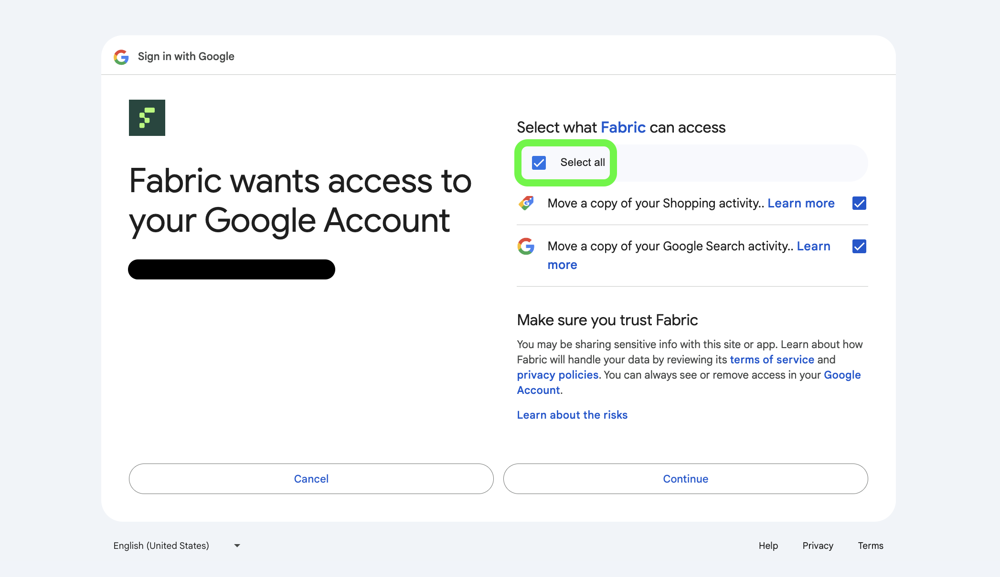
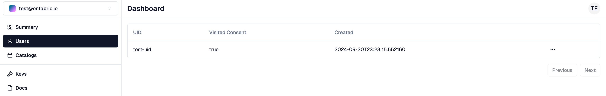

In this Quickstart you will create your own Digital Self by connecting your Google activity. You will then be able to ask arbitrary questions to your Digital Self. I promise that you will be surprised by how accurate it is.

This is how hyperpersonalization feels like.

## Create a developer profile

First of all, create a [developer profile](https://www.onfabric.io/customer/dashboard). This is where you will be able to see all the users that log in via Fabric. You can get an overview from the main page:


Create an API Key by clicking on Keys -> Create API Key:


Make sure to copy the API key as it will not be shown again. You can always create a second one.

## Onboard your first user

You are now ready to onboard your first user (yourself). Ready to create your Digital Self?

First, generate a user token for your first user by calling the Generate Token API:

```shell
curl -X POST https://auth.onfabric.io/api/v1/link/ \
     -H "api-key: <test-api-key>" \
     -H "Content-Type: application/json" \
     -d '{ "uid": "test-uid" }'
```

Make sure to replace `<test-api-key>` with the API key you obtained in the previous step. Also modify `test-uid` to a unique identifier of the user you are about to onboard.

The API returns a `token` in the response body. This is the unique token that identifies the onboarded user.

You are now ready to connect your Google activity via Fabric! Go to `https://www.onfabric.io/consent/fabric/google?token=` and append the token you just obtained.

You will be shown a consent flow to grant access to a hypothetical fashion retailer named "LOGO":


This consent flow can be completely personalized to best match your use case.

In just a few clicks you can grant Fabric access to your Google activity. Make sure to share both the "Search" and "Shopping" scopes. The more Fabric can learn from you, the better your online experience will be!



That's it! Fabric is now creating the Digital Self of the user you just onboarded.

After a few minutes you should see a user named `test-uid` (unless you provided a different UID) in the Users section of your [developer dashboard](https://www.onfabric.io/customer/dashboard/users):



You can finally ask any question to the Digital Self of the user you just onboarded via the Ask User API:

```shell
curl -G https://auth.onfabric.io/api/v1/user/ask \
     -H "api-key: <test-api-key>" \
     --data-urlencode "uid=test-uid" \
     --data-urlencode "q=<your-question>"
```

Once again, make sure to replace `<test-api-key>` with your API key and `<your-question>` with a question you want to ask to the user's Digital Self. Feel free to be creative in your question, but remember that Fabric can only answer questions based on the Google activity provided by the user.

For more insightful answers and even more personalized experience, the user can also grant Fabric access to their activity on Instagram, Facebook, TikTok, and much more.

The answer to the question is found in the `answer` of the response body.
